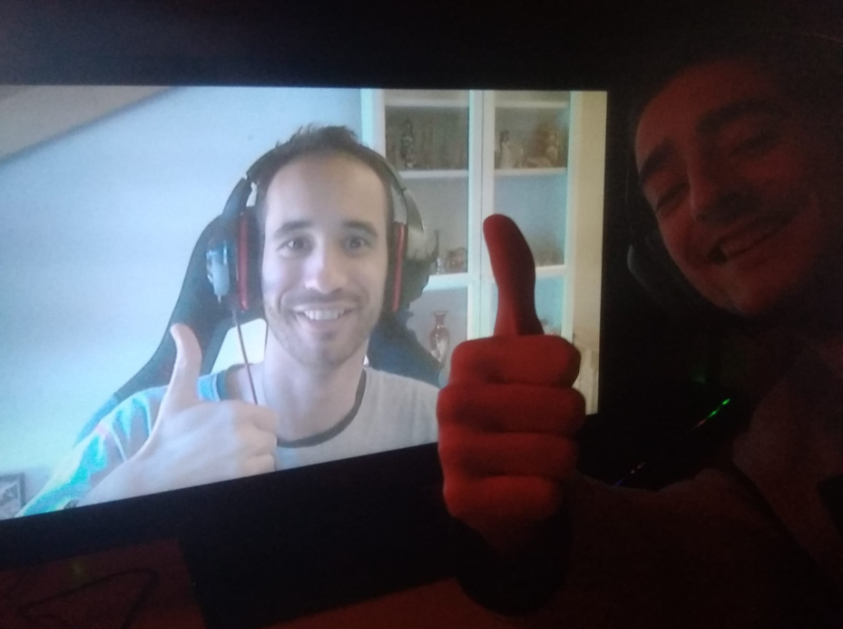

# Snowy Mists: About The game

Hi there! We're a pair of students from CITM's-UPC currently coursing the degree: Videogame Design & Development.
This right here is our little game for Development subject. We used C++ Language for the coding stuff via SDL and pugi libraries. Plus we used Tiled for creating the structure of the map, loading it's colliders and even the player animations.    

    

Our goal was to develop a 2D platformer using xml documents as configs and also xml documents for maps, player, ui, and enemies loading generated from Tiled. We tried to make a more likish Metroidvania game althought we ran out of time we are quite proud of the results and our work.    

# Team

As we said before, we are a team of two students, now we're gonna introduce some of the tasks that each one has been in charge during the process of the project.  

 

* Eudald Garrofé. Github user: [Hevne](https://github.com/Hevne) 
 
Hi! My name is Eudald Garrofé, I've been in charge of the major design decisions of the game as the game theme, the mechanics, music, sounds... the maps creation using Tiled and the code to load and unload each of them (Player position, colliders definition, path definition) has been my work too.   
Also I've been working on the transitions from scene to scene since as we said before we tried to make some kind of Metroidvania game but even if we couldn't implement all of our maps into the game the solid algorithm for transition between multiple interconnected maps is there.    
My proudest job in this project has been the whole Entity Manager system in which I defined all the character types and it's load and deletion plus the UML document.    
Making the game to work with Delta time it's something I dedicated time too    

* Jordi Pardo. Github user: [Jordi-Pardo](https://github.com/Jordi-Pardo) 
 
And I'm Jordi Pardo, I'm like the code guy here, I've been in charge of the collision system using sensors and the colliders boxes defined on Tiled by my team mate.   
The whole player system: state machine, lives, game feel... I've done the Pathfinding algorithm and the different states for enemies: movement, attacks, dead conditions...    
The camera and culling movement is part of my work too.    

# Github Repository

Our Github repository for the project:
https://github.com/Development-CITM/2D-Platformer  

Link to our latest release:
 

# Instructions to Play

Download the release and execute the: Snowy Mists.exe  
Once done you will get to the main menu where u can choose to start a new game, load from a previous save if it exists, choose your settings and take a look at our names and license in "Credits".

## Controls in game

* D: Move Right
* A: Move Left
* Right click: High Kick
* Left click: Linear punch
* SPACE/SPACE+A/SPACE+D: Jump/Jump left/Jump right
* SPACE + SPACE: Double Jump
* SPACE while falling: Jumping on air

## Debug controls

* F1: Goes to level 1
* F2: Goes to level 2
* F3: Resets current level
* F5: Saves player, enemies, camera and culling current state
* F6: Loads saved state
* F9: Shows colliders + Enemy paths
* F10: God Mode Enable/Disable
* F11: Enables cap to 30/Sets max frames to 60(Vsync)

## Enemy mechanics

* Enemy ground: Jump to dodge the attack from the enemy since it goes usually first then attack
* Enemy flying: Use high kick to kill the enemy if he's too high for linear punch
          
# License:

MIT License

Copyright (c) [2019] [Eudald Garrofé Flix, Jordi Pardo]

Permission is hereby granted, free of charge, to any person obtaining a copy
of this software and associated documentation files (the "Software"), to deal
in the Software without restriction, including without limitation the rights
to use, copy, modify, merge, publish, distribute, sublicense, and/or sell
copies of the Software, and to permit persons to whom the Software is
furnished to do so, subject to the following conditions:

The above copyright notice and this permission notice shall be included in all
copies or substantial portions of the Software.

THE SOFTWARE IS PROVIDED "AS IS", WITHOUT WARRANTY OF ANY KIND, EXPRESS OR
IMPLIED, INCLUDING BUT NOT LIMITED TO THE WARRANTIES OF MERCHANTABILITY,
FITNESS FOR A PARTICULAR PURPOSE AND NONINFRINGEMENT. IN NO EVENT SHALL THE
AUTHORS OR COPYRIGHT HOLDERS BE LIABLE FOR ANY CLAIM, DAMAGES OR OTHER
LIABILITY, WHETHER IN AN ACTION OF CONTRACT, TORT OR OTHERWISE, ARISING FROM,
OUT OF OR IN CONNECTION WITH THE SOFTWARE OR THE USE OR OTHER DEALINGS IN THE
SOFTWARE.
           
